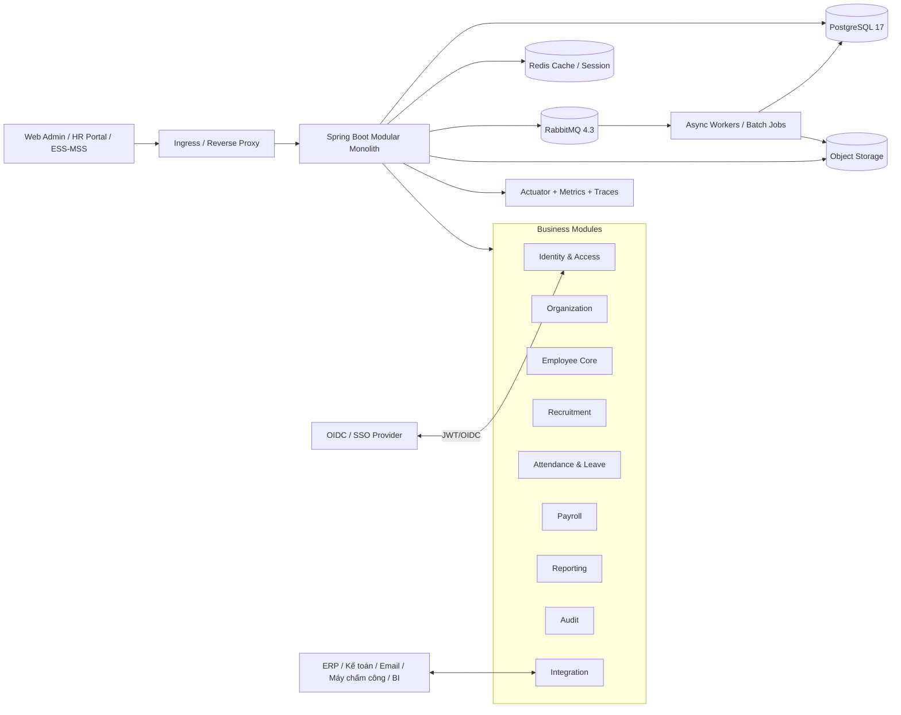
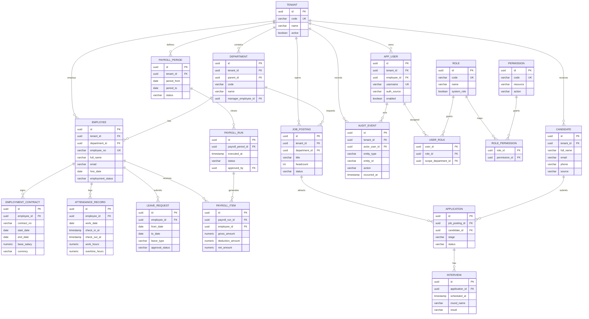
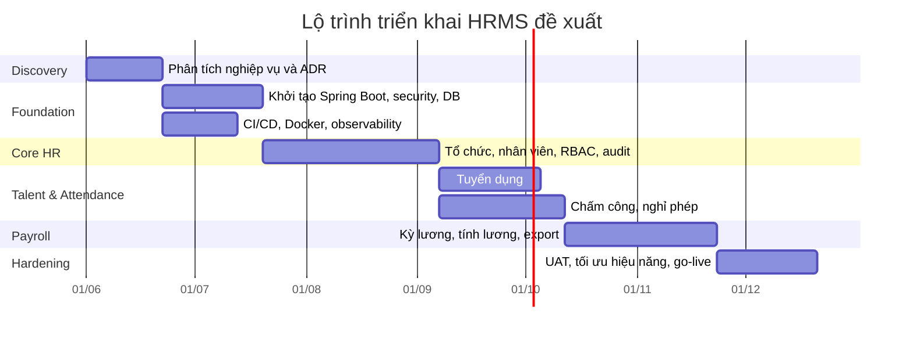

# Báo cáo phân tích và thiết kế kỹ thuật cho hệ thống quản lý nhân sự đa phòng ban bằng Java và IntelliJ IDEA

## Tóm tắt điều hành

Đề xuất phù hợp nhất cho bài toán “hệ thống quản lý nhân sự cho công ty nhiều phòng ban” là **kiến trúc modular monolith** trên **Java 21 LTS** và **Spring Boot 4.0.x**, phát triển bằng **IntelliJ IDEA**, dùng **PostgreSQL 17** làm cơ sở dữ liệu giao dịch chính, **Redis** cho cache và session phân tán, **RabbitMQ 4.3** cho tác vụ bất đồng bộ, **REST + OpenAPI 3.1** làm chuẩn API mặc định, và chỉ bổ sung **GraphQL** cho các màn hình tổng hợp dữ liệu phức tạp nếu thực sự cần. Hướng đi này tận dụng việc Spring Boot 4.0.6 hỗ trợ Java 17–26, Spring Modulith hỗ trợ tổ chức ứng dụng theo module nghiệp vụ, còn PostgreSQL có cơ chế Row-Level Security rất phù hợp nếu về sau cần multi-tenant hoặc phân tách dữ liệu mạnh ở tầng DB. citeturn1view1turn1view2turn8search0turn8search4turn16search24

Về mặt vận hành, đây là lựa chọn cân bằng giữa tốc độ triển khai, chi phí, khả năng kiểm thử và độ phức tạp hệ thống. Microservices có giá trị khi số lượng đội phát triển lớn, miền nghiệp vụ đủ độc lập, nhu cầu scale độc lập cao, hoặc tổ chức cần lịch phát hành tách biệt; nhưng với đa số HRMS nội bộ hoặc cho một nhóm công ty, modular monolith sẽ giảm đáng kể độ phức tạp phân tán, vẫn cho phép tách module theo business capability và sau này bóc tách dần thành dịch vụ độc lập nếu có nhu cầu. citeturn30search0turn30search1turn30search4turn30search21turn30search3

Về bảo mật, hệ thống nên mặc định dùng **RBAC** kết hợp permission chi tiết ở mức API và method, hỗ trợ **OAuth 2.0 / OpenID Connect** để tích hợp SSO nếu doanh nghiệp có IdP, lưu **audit** ở cả hai mức: audit kỹ thuật cho đăng nhập/ủy quyền và audit nghiệp vụ cho thay đổi dữ liệu HR, payroll, attendance, tuyển dụng. Spring Security, Spring Boot Actuator, Spring Data JPA Auditing và Hibernate Envers đều có sẵn cơ chế nền để làm việc này tốt hơn so với tự xây toàn bộ từ đầu. citeturn6search0turn6search4turn18search4turn5view0turn3view1turn31search2turn31search16

Nếu thông tin pháp lý, công thức lương, thuế, bảo hiểm, quy chế làm việc, tích hợp máy chấm công, tích hợp ERP/kế toán chưa được cung cấp thì các phần đó trong báo cáo này được mô tả ở mức **khung kiến trúc và thiết kế kỹ thuật**, còn **công thức chi tiết và chi phí chính xác** được ghi rõ là **không xác định** ở những nơi cần thiết. citeturn17search0turn17search14

## Yêu cầu hệ thống

### Phạm vi nghiệp vụ và giả định thiết kế

Bài toán được hiểu là HRMS cho doanh nghiệp có nhiều phòng ban, có thể có nhiều chi nhánh hoặc nhiều pháp nhân nội bộ, hỗ trợ tối thiểu các domain: **tổ chức**, **nhân viên**, **vai trò/quyền**, **tuyển dụng**, **chấm công/nghỉ phép**, **lương**, **báo cáo**, **API tích hợp**, **audit** và **bảo mật**. Thiết kế mặc định dưới đây ưu tiên mô hình **một công ty hoặc một nhóm công ty dùng chung một nền tảng**, còn multi-tenant ở mức SaaS nhiều khách hàng chỉ kích hoạt khi có yêu cầu cô lập dữ liệu tương ứng. Cách hiểu này phù hợp với các mô hình multi-tenancy mà Hibernate mô tả như separate database, separate schema và discriminator/partitioned data. citeturn4view0

Vì Spring Security cung cấp xác thực, ủy quyền và bảo vệ khỏi nhiều loại tấn công phổ biến; Spring Data JPA và Jakarta Persistence cung cấp nền persistence chuẩn; Spring Batch giải quyết tốt tải xử lý định kỳ; còn Spring Boot Actuator và observability stack hỗ trợ đo đạc, audit, health, metrics, traces, nên việc thiết kế một HRMS theo module nghiệp vụ nhưng dùng chung nền tảng kỹ thuật là lựa chọn thực dụng và có độ bền kỹ thuật cao. citeturn6search0turn2search11turn2search2turn32search0turn18search3turn18search8

### Yêu cầu chức năng chi tiết

| Miền chức năng | Yêu cầu chi tiết đề xuất |
|---|---|
| Quản lý tổ chức | Quản lý tenant nếu cần, công ty/pháp nhân, chi nhánh, phòng ban phân cấp, chức danh, vị trí tuyển dụng, trung tâm chi phí, người quản lý trực tiếp. |
| Quản lý nhân viên | Hồ sơ nhân viên, mã nhân viên, thông tin cá nhân, liên hệ, CCCD/hộ chiếu, hợp đồng lao động, lịch sử công tác, điều chuyển phòng ban, thăng chức, trạng thái làm việc, hồ sơ đính kèm. |
| Vai trò và permission | User nội bộ, SSO user, role theo nghiệp vụ, permission chi tiết theo action/resource, ràng buộc theo tenant/phòng ban, phê duyệt nhiều cấp. |
| Tuyển dụng | Job posting, candidate, application, interview, đánh giá, offer, chuyển candidate thành employee, lưu vết pipeline tuyển dụng. |
| Chấm công | Ca làm, lịch làm, check-in/check-out, import từ máy chấm công/API, OT, đi muộn/về sớm, bảng nghỉ lễ, nghỉ phép, phê duyệt leave. |
| Lương | Kỳ lương, payroll run, công thức tính lương nền, phụ cấp, khấu trừ, OT, truy lĩnh, bảng lương chi tiết, khóa kỳ lương, xuất dữ liệu cho kế toán/ngân hàng. |
| Báo cáo | Dashboard nhân sự, biến động nhân sự, headcount theo phòng ban, tuyển dụng, nghỉ phép, công, payroll summary, export CSV/XLSX/PDF. |
| API và tích hợp | REST API nội bộ/đối tác, webhook/event, import/export, tích hợp email, IdP/SSO, máy chấm công, ERP/kế toán, BI. |
| Audit | Audit đăng nhập, thất bại đăng nhập, phân quyền, thay đổi dữ liệu nhạy cảm, thay đổi bảng lương, thay đổi trạng thái hồ sơ ứng viên, truy xuất lịch sử thay đổi. |

Các yêu cầu trên là tập hợp yêu cầu nghiệp vụ đề xuất cho một HRMS thực tế; ở tầng kỹ thuật chúng tham chiếu trực tiếp đến các khả năng của chuẩn RBAC, Spring Security method authorization, Spring Data auditing, Hibernate Envers, Spring Batch và Spring Boot audit/observability. citeturn17search3turn17search23turn6search4turn5view0turn3view1turn18search4turn32search3

### Yêu cầu phi chức năng chi tiết

| Nhóm yêu cầu | Mục tiêu thiết kế đề xuất |
|---|---|
| Hiệu năng | Đọc hồ sơ, danh mục, báo cáo ngắn cần phản hồi nhanh; tính lương, import lớn, export lớn chạy bất đồng bộ. |
| Khả năng mở rộng | Scale ngang tầng ứng dụng; DB scale dọc trước, tối ưu index và partition/reporting view trước khi nghĩ tới tách service. |
| Tính sẵn sàng | Có health check, backup, restore drill, retry có kiểm soát, idempotency cho tác vụ tích hợp. |
| Quan sát hệ thống | Metrics, logs, traces, audit trail, correlation ID, dashboard vận hành. |
| Bảo mật | RBAC, least privilege, secrets management, TLS, CSRF phù hợp kiểu auth, password hashing một chiều, mã hóa dữ liệu nhạy cảm khi cần. |
| Nhất quán dữ liệu | Transaction rõ ràng cho nghiệp vụ HR core; payroll run và attendance close phải có trạng thái, khóa kỳ, và audit. |
| Kiểm thử | Unit test, slice test, integration test với DB thật bằng container, test bảo mật và migration test. |
| Triển khai | Docker hóa; dev dùng local container; prod có thể là VM/Docker Compose hoặc Kubernetes tùy độ trưởng thành vận hành. |
| Multi-tenant | Mặc định không bật nếu chỉ một công ty; nếu nhiều tenant thì phải có tenant context, tenant_id ở dữ liệu nghiệp vụ, và có thể áp RLS/schema separation. |

Spring Boot Actuator hỗ trợ built-in endpoints để giám sát và quản lý ứng dụng; observability của Spring Boot dựa trên metrics, logs và traces; Testcontainers cho phép test với DB thật trong container; Docker và Kubernetes lần lượt giải quyết đóng gói và orchestration; PostgreSQL RLS và Hibernate multi-tenancy là nền kỹ thuật phù hợp nếu cần cô lập dữ liệu tenant ở mức cao hơn. citeturn18search8turn18search3turn14search4turn15search6turn15search3turn8search0turn4view0

## Kiến trúc và công nghệ đề xuất

### Quyết định kiến trúc

Khuyến nghị chính là **modular monolith** theo business module, không phải “monolith vô tổ chức”. Cụ thể, dùng một ứng dụng Spring Boot duy nhất nhưng chia module rõ ràng: `identity-access`, `organization`, `employee-core`, `recruitment`, `attendance`, `payroll`, `reporting`, `audit`, `integration`. Spring Modulith được tạo ra đúng cho mục tiêu xây ứng dụng Spring Boot có cấu trúc module theo domain và giúp phân tách tương tác giữa các phần logic của hệ thống. citeturn1view2

Lý do chưa nên vào microservices ngay từ đầu là vì microservices làm tăng độ phức tạp phân tán: giao tiếp mạng, tracing, retry, eventual consistency, versioning hợp đồng API, CI/CD đa dịch vụ, database ownership, và vận hành phức tạp hơn. AWS Prescriptive Guidance mô tả việc decomposition sang microservices là một quá trình có pattern và chi phí tổ chức; Martin Fowler cũng nổi tiếng với quan điểm “monolith first” cho sản phẩm mới nếu chưa có lý do rất mạnh để phân tán sớm. citeturn30search1turn30search12turn30search3

Khi nào mới nên tách microservices? Khi có ít nhất một số tín hiệu sau: module payroll cần release cadence riêng; attendance ingest từ hàng trăm thiết bị chấm công tạo tải độc lập; reporting/analytics cần pipeline sự kiện riêng; hoặc tổ chức có nhiều đội độc lập cùng sở hữu từng miền nghiệp vụ. Khi đó có thể bóc dần theo business capability như hướng dẫn decomposition by business capability của AWS. citeturn30search21turn30search5

### Sơ đồ thành phần và luồng dữ liệu



Sơ đồ trên phản ánh luồng xử lý nên dùng cho hệ HRMS: phần lớn nghiệp vụ giao dịch đi thẳng qua REST vào ứng dụng lõi; các tác vụ dài như import attendance, export báo cáo lớn, gửi email, generate payslip, đồng bộ ERP nên đi qua hàng đợi hoặc batch worker để tách khỏi request đồng bộ. Spring Batch được thiết kế cho batch nghiệp vụ doanh nghiệp; Spring AMQP và RabbitMQ phù hợp cho messaging AMQP; còn Spring Boot Actuator/observability cung cấp nền theo dõi production. citeturn32search3turn35search0turn34search2turn18search8turn18search3

### Công nghệ cụ thể đề xuất

| Lớp | Khuyến nghị chính | Lý do chọn |
|---|---|---|
| JDK | **Java 21 LTS** trên **Eclipse Temurin 21** | Java 21 là LTS; Temurin là OpenJDK enterprise-ready, TCK-tested và không có phí license như một số mô hình thương mại; Java 21 cũng có virtual threads cho tác vụ I/O-bound nếu cần. citeturn24search2turn24search3turn24search16turn29search0turn29search2 |
| Web framework | **Spring Boot 4.0.6** | Hiện là stable, hỗ trợ Java 17–26, có starter ecosystem mạnh, actuator, testing, security, data access. citeturn1view1turn16search24 |
| Tổ chức module | **Spring Modulith** | Phù hợp để xây modular application theo domain trước khi nghĩ đến microservices. citeturn1view2 |
| Bảo mật | **Spring Security 7.0.x** + OIDC/OAuth2 | Hỗ trợ authentication, authorization, chống common attacks, method security, JWT resource server. citeturn6search0turn6search4turn31search16 |
| Authorization server | **External IdP / Spring Authorization Server** | Nếu công ty có IdP thì tích hợp OIDC là tốt nhất; nếu tự host thì Spring Authorization Server là nền mở, tùy biến được. citeturn31search0turn31search2turn31search12 |
| Persistence | **Spring Data JPA + Jakarta Persistence 3.2** | Chuẩn ORM Java hiện đại, repository model nhất quán, dễ audit và transaction management. citeturn2search2turn2search11 |
| Provider ORM | **Hibernate ORM theo BOM của Spring Boot** | Tránh pin version rời gây lệch tương thích; dùng Envers nếu cần lịch sử thay đổi entity. citeturn25search1turn3view1 |
| DBMS | **PostgreSQL 17** | Hỗ trợ RLS, phù hợp mô hình multi-tenant và phân quyền dữ liệu; PostgreSQL 17 đã là bản GA và được RDS hỗ trợ. citeturn8search0turn8search1turn23search3 |
| Cache | **Redis** | Spring Data Redis hỗ trợ cache abstraction; Redis có TTL rõ ràng và phù hợp cache/session/token blacklist. citeturn10search1turn10search2turn10search21 |
| Message broker | **RabbitMQ 4.3** | RabbitMQ là broker trưởng thành, dễ triển khai; queue có ngữ nghĩa FIFO; quorum queue là lựa chọn mặc định cho data safety. citeturn34search2turn34search3turn34search6turn35search5 |
| API mặc định | **REST + OpenAPI 3.1** | OAS là chuẩn mô tả HTTP API; REST phù hợp giao dịch nghiệp vụ và tích hợp đa hệ thống. citeturn12search3turn12search7 |
| API tùy chọn | **Spring GraphQL** cho read-composition | GraphQL hữu ích khi UI cần tổng hợp dữ liệu nhiều nguồn với một request; không nên thay REST cho mọi transaction. citeturn12search1turn12search13turn12search21 |
| Batch & scheduler | **Spring Batch 6 + TaskScheduler/Quartz nếu cần** | Batch phù hợp payroll close, import/export lớn; scheduling nên tách biệt với logic batch. citeturn32search0turn32search3turn32search2 |
| Migration DB | **Flyway** | Versioned migration chạy đúng một lần, có schema history và checksum; dễ quản trị cho team Java. citeturn16search0turn16search2turn16search13 |
| Testing | **spring-boot-starter-test + JUnit + Testcontainers + spring-security-test** | Spring Boot có test slices; Testcontainers cho DB thật; Spring Security có test support riêng. citeturn13search2turn13search8turn14search4turn14search10turn13search20 |
| Build tool | **Maven 3.9.x** | Spring Boot khuyến nghị Maven hoặc Gradle; Maven 4 vẫn chưa safe for production, nên Maven 3.9.x là lựa chọn ổn định. citeturn25search2turn7search4turn7search12 |
| CI/CD | **GitHub Actions hoặc GitLab CI/CD** | Cả hai đều hỗ trợ build-test-deploy pipeline; lựa chọn cuối phụ thuộc nơi host source code, hiện **không xác định**. citeturn15search8turn15search5 |
| Containerization | **Docker**, Kubernetes khi scale/HA cao | Docker là nền tảng chuẩn cho đóng gói; Kubernetes hữu ích khi cần orchestration, scale và automation cao. citeturn15search6turn15search3 |
| Observability | **Spring Boot Actuator + Micrometer + OpenTelemetry** | Spring Boot hỗ trợ health, metrics, traces; OpenTelemetry là chuẩn vendor-neutral cho telemetry. citeturn18search8turn18search3turn18search15turn18search18 |

### Bảng so sánh lựa chọn công nghệ và lý do chọn

| Quyết định | Lựa chọn A | Lựa chọn B | Nên chọn | Lý do |
|---|---|---|---|---|
| Kiến trúc triển khai | Monolith có module | Microservices | **Monolith có module** | Với HRMS mới, modular monolith ít phức tạp hơn nhưng vẫn cho phép decomposition theo business capability về sau. citeturn1view2turn30search1turn30search3 |
| DBMS | PostgreSQL 17 | MySQL 8.4 LTS | **PostgreSQL 17** | PostgreSQL có RLS rất hợp multi-tenant/phân quyền dữ liệu; MySQL 8.4 là lựa chọn hợp lệ nhưng thiên về đơn giản hóa hơn. MySQL 8.0 đã EoL từ 04/2026, nên nếu dùng MySQL thì nên đi 8.4 LTS. citeturn8search0turn8search4turn9search0turn9search3 |
| Messaging | RabbitMQ 4.3 | Kafka | **RabbitMQ 4.3** | HRMS thường cần task queue, notification, integration event vừa phải; RabbitMQ dễ vận hành hơn. Kafka mạnh cho event streaming quy mô lớn và analytics thời gian thực. citeturn34search2turn34search3turn34search0turn34search11 |
| API | REST | GraphQL | **REST mặc định** | REST dễ governance, authz, audit, tích hợp ERP/BI; GraphQL chỉ nên thêm ở lớp read-composition cho dashboard phức tạp. citeturn12search3turn12search1turn12search13 |
| Build | Maven 3.9.x | Gradle 9.x | **Maven 3.9.x** | Ổn định, quen thuộc với dự án Java doanh nghiệp; Maven 4 còn chưa production-safe. Gradle vẫn tốt nếu team đã chuẩn hóa trên Gradle. citeturn7search4turn7search12turn7search1turn7search5 |
| Migration | Flyway | Liquibase | **Flyway** | Flyway phù hợp SQL-first và schema history rõ ràng; Liquibase mạnh nếu team muốn change log declarative và diff-based. citeturn16search0turn16search2turn16search13turn16search5 |
| CI/CD | GitHub Actions | GitLab CI/CD | **Không xác định** | Cả hai đều đủ tốt; chọn theo SCM và mô hình hạ tầng hiện có. citeturn15search8turn15search5 |

## Thiết kế dữ liệu và API

### Nguyên tắc mô hình dữ liệu

Thiết kế dữ liệu nên theo các nguyên tắc sau: mọi bảng nghiệp vụ chính đều có `id`, `tenant_id` nếu bật multi-tenant, `created_at`, `updated_at`, `created_by`, `updated_by`; các dữ liệu thay đổi mạnh như hợp đồng, phân công phòng ban, vai trò, bảng lương cần lưu **lịch sử** thay vì overwrite đơn thuần; các tác vụ tích hợp phải có **outbox/integration_event** để bảo đảm phát event an toàn; các thao tác payroll phải “khóa kỳ” sau khi chốt. Các nguyên tắc này bám sát khả năng auditing của Spring Data JPA, audit history của Hibernate Envers và các mô hình multi-tenancy mà Hibernate hỗ trợ. citeturn5view0turn3view1turn4view0

Nếu dùng PostgreSQL cho mô hình shared-schema multi-tenant, nên kết hợp `tenant_id` ở bảng nghiệp vụ với chính sách `CREATE POLICY` và `ENABLE ROW LEVEL SECURITY` để giảm rủi ro truy cập chéo tenant do lỗi ứng dụng. Đây là điểm PostgreSQL mạnh hơn nhiều RDBMS khác cho bài toán này. citeturn8search0turn8search4

### ERD đề xuất



### Danh mục bảng chi tiết

| Nhóm | Bảng chính | Mục đích |
|---|---|---|
| Nền tảng | `tenant`, `app_user`, `role`, `permission`, `user_role`, `role_permission` | Tenant, danh tính người dùng, phân quyền RBAC |
| Tổ chức | `department`, `job_title`, `cost_center` | Cấu trúc phòng ban, chức danh, quy chiếu chi phí |
| Nhân sự lõi | `employee`, `employment_contract`, `employee_document`, `employee_bank_account`, `employee_history` | Hồ sơ nhân viên và lịch sử biến động |
| Tuyển dụng | `job_posting`, `candidate`, `application`, `interview`, `offer_letter` | Pipeline tuyển dụng |
| Chấm công | `shift`, `work_schedule`, `attendance_record`, `leave_request`, `holiday_calendar` | Ca làm, công, nghỉ phép |
| Lương | `payroll_period`, `payroll_run`, `payroll_item`, `salary_component`, `deduction_rule`, `payslip_file` | Kỳ lương, kết quả tính lương, xuất phiếu lương |
| Tích hợp | `integration_endpoint`, `integration_event_outbox`, `import_job`, `export_job` | Giao tiếp hệ ngoài, import/export, outbox |
| Audit | `audit_event`, `login_audit`, `entity_revision` | Audit kỹ thuật và nghiệp vụ |

### SQL mẫu

Ví dụ dưới đây dùng PostgreSQL. Nó minh họa cách tạo bảng cốt lõi, index, foreign key, audit columns và mở đường cho RLS nếu về sau cần shared-schema multi-tenant. PostgreSQL hỗ trợ Row Security và `CREATE POLICY`; Flyway là công cụ phù hợp để quản trị các migration SQL versioned như các script sau. citeturn8search0turn8search4turn16search0turn16search2

```sql
create table tenant (
    id uuid primary key,
    code varchar(50) not null unique,
    name varchar(255) not null,
    active boolean not null default true,
    created_at timestamptz not null default now(),
    updated_at timestamptz not null default now()
);

create table department (
    id uuid primary key,
    tenant_id uuid not null references tenant(id),
    parent_id uuid null references department(id),
    code varchar(50) not null,
    name varchar(255) not null,
    manager_employee_id uuid null,
    created_at timestamptz not null default now(),
    updated_at timestamptz not null default now(),
    unique (tenant_id, code)
);

create table employee (
    id uuid primary key,
    tenant_id uuid not null references tenant(id),
    department_id uuid not null references department(id),
    employee_no varchar(50) not null,
    full_name varchar(255) not null,
    email varchar(255),
    phone varchar(50),
    hire_date date not null,
    employment_status varchar(30) not null,
    created_by varchar(100),
    created_at timestamptz not null default now(),
    updated_by varchar(100),
    updated_at timestamptz not null default now(),
    unique (tenant_id, employee_no)
);

create index idx_employee_tenant_department
    on employee (tenant_id, department_id);

create table payroll_period (
    id uuid primary key,
    tenant_id uuid not null references tenant(id),
    period_from date not null,
    period_to date not null,
    status varchar(30) not null,
    locked boolean not null default false,
    approved_by varchar(100),
    approved_at timestamptz,
    created_at timestamptz not null default now(),
    unique (tenant_id, period_from, period_to)
);

create table payroll_run (
    id uuid primary key,
    payroll_period_id uuid not null references payroll_period(id),
    status varchar(30) not null,
    executed_at timestamptz,
    note text
);

create table payroll_item (
    id uuid primary key,
    payroll_run_id uuid not null references payroll_run(id),
    employee_id uuid not null references employee(id),
    gross_amount numeric(18,2) not null default 0,
    deduction_amount numeric(18,2) not null default 0,
    net_amount numeric(18,2) not null default 0,
    currency varchar(3) not null default 'VND'
);

create index idx_payroll_item_run_employee
    on payroll_item (payroll_run_id, employee_id);
```

Ví dụ kích hoạt RLS cho bảng `employee` trong mô hình shared-schema:

```sql
alter table employee enable row level security;

create policy employee_tenant_policy
on employee
using (tenant_id = current_setting('app.tenant_id')::uuid);
```

### Thiết kế API

Thiết kế API nên lấy **REST** làm chuẩn chính, mô tả bằng **OpenAPI 3.1**, có versioning theo `/api/v1`, dùng JSON camelCase ổn định, idempotency key cho import/upload hoặc thao tác có retry, và JWT/OIDC cho xác thực người dùng. OAS là chuẩn mô tả HTTP API; OAuth 2.0 là chuẩn ủy quyền; OpenID Connect xây trên OAuth 2.0 để giải quyết xác thực người dùng; Spring Security/Spring Authorization Server có hỗ trợ tương ứng. citeturn12search3turn31search1turn31search2turn31search16

Cấu hình xác thực khuyến nghị:

- **Người dùng nội bộ**: Authorization Code + PKCE qua OIDC nếu có IdP.
- **Machine-to-machine integration**: Client Credentials.
- **API nội bộ từ portal/backend**: Bearer JWT.
- **Session/cookie UI truyền thống**: giữ CSRF protection đúng mặc định của Spring Security cho unsafe methods. citeturn31search21turn31search9turn6search2

Các endpoint cốt lõi đề xuất:

| Miền | Endpoint mẫu | Chức năng |
|---|---|---|
| Auth | `POST /api/v1/auth/token` | Lấy token nếu tự host auth server |
| User & IAM | `GET /api/v1/users/me` | Thông tin người dùng hiện tại |
| Department | `GET /api/v1/departments` | Danh sách phòng ban |
| Department | `POST /api/v1/departments` | Tạo phòng ban |
| Employee | `GET /api/v1/employees` | Tìm kiếm nhân viên |
| Employee | `POST /api/v1/employees` | Tạo nhân viên |
| Employee | `GET /api/v1/employees/{id}` | Chi tiết nhân viên |
| Employee | `PATCH /api/v1/employees/{id}` | Cập nhật một phần |
| Recruitment | `POST /api/v1/job-postings` | Tạo tin tuyển dụng |
| Recruitment | `POST /api/v1/candidates` | Tạo ứng viên |
| Recruitment | `POST /api/v1/applications` | Nộp hồ sơ ứng tuyển |
| Attendance | `POST /api/v1/attendance/check-in` | Check-in hoặc import record |
| Attendance | `POST /api/v1/leave-requests` | Tạo đơn nghỉ phép |
| Payroll | `POST /api/v1/payroll-periods` | Tạo kỳ lương |
| Payroll | `POST /api/v1/payroll-runs/{periodId}/execute` | Tính lương |
| Payroll | `POST /api/v1/payroll-runs/{id}/approve` | Duyệt khóa kỳ |
| Reports | `POST /api/v1/reports/exports` | Tạo job export |
| Audit | `GET /api/v1/audit-events` | Tra cứu audit nghiệp vụ |

Ví dụ payload tạo nhân viên:

```json
{
  "employeeNo": "E-2026-00125",
  "fullName": "Nguyễn Văn A",
  "email": "vana@company.vn",
  "phone": "0900000000",
  "departmentId": "92b2d9df-4e7c-4dc6-a3c7-f32b2d0f8a10",
  "hireDate": "2026-06-01",
  "employmentStatus": "ACTIVE",
  "contracts": [
    {
      "contractNo": "HDLD-2026-00125",
      "startDate": "2026-06-01",
      "baseSalary": 18000000,
      "currency": "VND"
    }
  ]
}
```

Ví dụ response chi tiết nhân viên:

```json
{
  "id": "af4770d3-6b4b-4bb6-99eb-44a1c8b7c4e0",
  "employeeNo": "E-2026-00125",
  "fullName": "Nguyễn Văn A",
  "department": {
    "id": "92b2d9df-4e7c-4dc6-a3c7-f32b2d0f8a10",
    "name": "Phòng Kỹ thuật"
  },
  "employmentStatus": "ACTIVE",
  "hireDate": "2026-06-01",
  "audit": {
    "createdAt": "2026-06-01T08:30:00Z",
    "createdBy": "hr.admin"
  }
}
```

Ví dụ header authentication:

```http
Authorization: Bearer eyJraWQiOi...
X-Tenant-Id: tenant-acme
X-Correlation-Id: 7c7e0788-7f1b-4dc0-b856-6d5933c9d95f
```

### Ví dụ mã Java ngắn

Ví dụ mô hình dữ liệu JPA:

```java
package com.company.hrms.employee.domain;

import jakarta.persistence.*;
import org.springframework.data.annotation.CreatedDate;
import org.springframework.data.annotation.LastModifiedDate;

import java.time.Instant;
import java.time.LocalDate;
import java.util.UUID;

@Entity
@Table(name = "employee",
       uniqueConstraints = @UniqueConstraint(name = "uk_employee_tenant_no",
                                             columnNames = {"tenant_id", "employee_no"}))
public class Employee {

    @Id
    private UUID id;

    @Column(name = "tenant_id", nullable = false)
    private UUID tenantId;

    @Column(name = "employee_no", nullable = false, length = 50)
    private String employeeNo;

    @Column(name = "full_name", nullable = false, length = 255)
    private String fullName;

    @ManyToOne(fetch = FetchType.LAZY, optional = false)
    @JoinColumn(name = "department_id")
    private Department department;

    @Column(name = "hire_date", nullable = false)
    private LocalDate hireDate;

    @Enumerated(EnumType.STRING)
    @Column(name = "employment_status", nullable = false, length = 30)
    private EmploymentStatus employmentStatus;

    @CreatedDate
    @Column(name = "created_at", nullable = false, updatable = false)
    private Instant createdAt;

    @LastModifiedDate
    @Column(name = "updated_at", nullable = false)
    private Instant updatedAt;

    protected Employee() {
    }

    public Employee(UUID id, UUID tenantId, String employeeNo, String fullName,
                    Department department, LocalDate hireDate, EmploymentStatus employmentStatus) {
        this.id = id;
        this.tenantId = tenantId;
        this.employeeNo = employeeNo;
        this.fullName = fullName;
        this.department = department;
        this.hireDate = hireDate;
        this.employmentStatus = employmentStatus;
    }

    // getters/setters rút gọn
}
```

Ví dụ endpoint REST ngắn:

```java
package com.company.hrms.employee.interfaces.api;

import com.company.hrms.employee.application.EmployeeService;
import com.company.hrms.employee.interfaces.dto.EmployeeResponse;
import org.springframework.security.access.prepost.PreAuthorize;
import org.springframework.web.bind.annotation.*;

import java.util.UUID;

@RestController
@RequestMapping("/api/v1/employees")
public class EmployeeController {

    private final EmployeeService employeeService;

    public EmployeeController(EmployeeService employeeService) {
        this.employeeService = employeeService;
    }

    @GetMapping("/{id}")
    @PreAuthorize("hasAuthority('employee:read')")
    public EmployeeResponse getById(@PathVariable UUID id,
                                    @RequestHeader("X-Tenant-Id") UUID tenantId) {
        return employeeService.getById(tenantId, id);
    }
}
```

Đoạn mã trên bám vào Jakarta Persistence, Spring Data auditing và Spring Security method authorization — tức là đúng stack được khuyến nghị cho hệ thống này. citeturn2search2turn5view0turn6search4

## Cấu trúc dự án IntelliJ IDEA

### Mẫu cấu trúc dự án khuyến nghị

Với IntelliJ IDEA và Maven, nên dùng **multi-module Maven** hoặc **single-module Maven nhưng phân package theo modulith**. Nếu đội chưa mạnh về build đa module, nên bắt đầu bằng **single deployable / multi-package modulith**, sau đó nâng cấp sang multi-module nếu cần kiểm soát boundary chặt hơn. Spring Boot nhấn mạnh việc dùng build system có dependency management như Maven hoặc Gradle; IntelliJ IDEA có project wizard tích hợp Spring Boot/Spring Initializr để khởi tạo trực tiếp. citeturn25search2turn19search5turn19search9

Cấu trúc đề xuất:

```text
hrms-platform/
├─ pom.xml
├─ README.md
├─ docker/
│  ├─ Dockerfile
│  └─ compose.yml
├─ docs/
│  ├─ architecture/
│  ├─ api/
│  └─ adr/
├─ src/
│  ├─ main/
│  │  ├─ java/com/company/hrms/
│  │  │  ├─ HrmsApplication.java
│  │  │  ├─ shared/
│  │  │  │  ├─ config/
│  │  │  │  ├─ security/
│  │  │  │  ├─ audit/
│  │  │  │  ├─ tenant/
│  │  │  │  ├─ exception/
│  │  │  │  └─ util/
│  │  │  ├─ identity/
│  │  │  │  ├─ application/
│  │  │  │  ├─ domain/
│  │  │  │  ├─ infrastructure/
│  │  │  │  └─ interfaces/api/
│  │  │  ├─ organization/
│  │  │  ├─ employee/
│  │  │  ├─ recruitment/
│  │  │  ├─ attendance/
│  │  │  ├─ payroll/
│  │  │  ├─ reporting/
│  │  │  └─ integration/
│  │  └─ resources/
│  │     ├─ application.yml
│  │     ├─ application-dev.yml
│  │     ├─ db/migration/
│  │     ├─ openapi/
│  │     └─ templates/
│  └─ test/
│     ├─ java/com/company/hrms/
│     │  ├─ unit/
│     │  ├─ integration/
│     │  ├─ security/
│     │  └─ architecture/
│     └─ resources/
│        ├─ application-test.yml
│        └─ sql/
└─ .github/workflows/ hoặc .gitlab-ci.yml
```

Trong từng module, nên đi theo cấu trúc `application / domain / infrastructure / interfaces`, để phân biệt use case, entity/domain rule, persistence adapter và API adapter. Cách này tương thích rất tốt với tư duy modulith và giúp sau này bóc tách từng business capability sang service riêng nếu cần. citeturn1view2turn30search21

### Plugin IntelliJ IDEA hữu ích

| Plugin / tính năng | Giá trị thực tế |
|---|---|
| **Spring / Spring Boot support** | Tạo project bằng Spring Initializr, navigation bean, debugger, run config, Spring profiles. |
| **Spring Modulith support** | Quan sát boundary module ngay trong IDE nếu dùng IntelliJ IDEA Ultimate. |
| **Database Tools and SQL** | Quản lý PostgreSQL/MySQL trực tiếp trong IDE, xem schema, kiểm tra query. |
| **HTTP Client** | Gọi thử REST API ngay trong file `.http`, thay thế một phần Postman cho dev nội bộ. |
| **OpenAPI support** | Sinh request từ spec và đối chiếu endpoint với tài liệu API. |
| **Docker plugin** | Quản lý Docker image/container/Compose từ IDE. |
| **Kubernetes plugin** | Có ích nếu prod chạy K8s; không bắt buộc ở giai đoạn đầu. |
| **SonarQube for IDE** | Static analysis ngay trong editor, hữu ích cho bảo mật và chất lượng code. |
| **JPA Buddy** | Tăng tốc thiết kế entity, repository, migration, best practice JPA. |

JetBrains xác nhận IntelliJ IDEA Ultimate có hỗ trợ Spring, Docker, Spring Modulith, Database Tools, Endpoints/OpenAPI và Kubernetes mạnh hơn đáng kể so với Community Edition; đồng thời HTTP Client là tính năng rất hữu ích để thử API trực tiếp từ editor. SonarQube for IDE và JPA Buddy là hai plugin phổ biến cho chất lượng mã và năng suất JPA. citeturn19search0turn19search1turn19search15turn21search0turn20search1turn21search1turn21search4turn21search8turn19search2turn20search2

Khuyến nghị thực tế là dùng **IntelliJ IDEA Ultimate** cho dự án kiểu này, vì Spring, database, Docker và OpenAPI/Kubernetes support trong Ultimate giúp giảm nhiều thao tác thủ công. Nếu buộc dùng Community Edition thì vẫn phát triển được, nhưng năng suất sẽ thấp hơn ở các phần doanh nghiệp. citeturn19search0turn21search9

## Lộ trình phát triển và nguồn lực

### Lộ trình theo giai đoạn

Với budget chưa xác định, cách an toàn nhất là chia thành các giai đoạn phát hành có giá trị nghiệp vụ rõ ràng. Một kế hoạch thực tế cho HRMS mức trung bình là **khoảng 6 đến 8 tháng** để đạt production-ready bản đầu, nếu phạm vi payroll không quá đặc thù và tích hợp ngoài không quá phức tạp. Nếu payroll có công thức phức tạp, nhiều chính sách phúc lợi, hoặc cần tích hợp sâu với máy chấm công/ERP hiện hữu, mốc này có thể tăng đáng kể và phần tăng thêm hiện **không xác định**. Việc dùng Spring Boot, Spring Security, Flyway, Testcontainers và Docker giúp rút ngắn đáng kể thời gian xây “nền kỹ thuật” so với tự lắp ghép thủ công. citeturn16search24turn6search0turn16search0turn14search4turn15search6

Phân bổ giai đoạn đề xuất:

| Giai đoạn | Kết quả chính | Thời lượng gợi ý |
|---|---|---|
| Discovery & solution design | Làm rõ nghiệp vụ, phân tích dữ liệu, ADR, wireframe, PoC auth/DB | 2–3 tuần |
| Foundation | Khởi tạo project, security base, migration, logging, observability, CI/CD | 3–4 tuần |
| Core HR | Department, employee, user-role-permission, audit, import cơ bản | 6–8 tuần |
| Recruitment & attendance | Job posting, candidate, application, interview, leave, attendance | 6–8 tuần |
| Payroll & reporting | Payroll period, payroll run, export, dashboard cơ bản | 6–8 tuần |
| UAT & hardening | Performance test, security review, backup/restore, cutover | 3–4 tuần |

### Biểu đồ timeline



### Ước tính nhân lực

Một đội hình khởi đầu thực tế:

| Vai trò | Quy mô gợi ý |
|---|---|
| Product owner / BA | 1 |
| Solution architect / Tech lead | 1 |
| Backend Java engineer | 2–4 |
| Frontend engineer | 1–2 |
| QA / Test engineer | 1–2 |
| DevOps / Platform engineer | 0.5–1 |
| UI/UX | 0.5–1 |

Mô hình tối ưu là **1 tech lead + 3 backend + 1 frontend + 1 QA + 0.5 DevOps**, đủ để giữ chất lượng kiến trúc, tiến độ và automation mà chưa cần tổ chức quá nặng. Nếu chọn microservices ngay từ đầu thì nhu cầu DevOps, observability, contract testing và release management sẽ tăng lên đáng kể. citeturn30search0turn30search1turn18search3turn15search3

## Rủi ro, bảo mật và chi phí vận hành

### Rủi ro và biện pháp giảm thiểu

| Rủi ro | Tác động | Giảm thiểu |
|---|---|---|
| Phân quyền sai hoặc thiếu | Lộ dữ liệu HR/payroll | RBAC chuẩn hóa theo NIST, permission theo action/resource, method security, kiểm thử quyền tự động. citeturn17search3turn17search11turn6search4 |
| Broken access control / multi-tenant leak | Truy cập chéo phòng ban/tenant | Bắt buộc `tenant_id`, scope department, query filter, và RLS ở PostgreSQL khi bật multi-tenant. citeturn17search14turn8search0turn8search4turn4view0 |
| Lưu mật khẩu/secret không an toàn | Chiếm quyền hệ thống | Không lưu mật khẩu reversible; dùng PasswordEncoder; secrets management tập trung; rotation định kỳ. citeturn6search1turn17search1turn17search17 |
| Thiếu audit | Không truy vết được thay đổi lương/nhân sự | Spring Data auditing cho create/update; Envers hoặc bảng audit riêng cho lịch sử entity; Actuator audit cho auth events. citeturn5view0turn3view1turn18search4 |
| Tính lương sai do dữ liệu công/leave không khóa | Sai bảng lương, tranh chấp nghiệp vụ | Có trạng thái kỳ, snapshot dữ liệu nguồn, approve workflow, re-run có version. citeturn32search3turn17search0 |
| Injection và input validation yếu | Rủi ro bảo mật nghiêm trọng | Dùng JPA/parameterized query, validation đầu vào, kiểm soát output và review theo OWASP ASVS/Top 10. citeturn17search0turn17search14turn17search22 |
| Thiếu CSRF/XSS/session hardening | Tấn công web app | Giữ CSRF mặc định cho session/cookie flow; CSP/XSS escaping ở phía UI; secure cookie và TLS. citeturn6search2turn17search14 |
| Migration schema thiếu kiểm soát | Mất đồng bộ môi trường | Flyway trong CI/CD, migration review, restore test định kỳ. citeturn16search0turn16search11turn16search13 |
| Test dùng DB giả không phản ánh production | Lỗi chỉ xuất hiện khi lên thật | Dùng Testcontainers với PostgreSQL/Redis/RabbitMQ thật trong integration test. citeturn14search4turn14search10turn14search19 |

OWASP ASVS là khung rất phù hợp để biến các yêu cầu bảo mật từ “khuyến nghị” thành checklist nghiệm thu kỹ thuật cho từng sprint hoặc cho gate trước go-live. Với hệ thống xử lý dữ liệu nhân sự và lương, điều này đặc biệt quan trọng vì tính nhạy cảm dữ liệu cao hơn đa số ứng dụng CRUD thông thường. citeturn17search0turn17search14

### Ước tính chi phí vận hành và hạ tầng

Chi phí chính xác phụ thuộc cloud provider, region, HA level, số người dùng, dung lượng dữ liệu, retention log, chính sách backup, loại IdP, cách gửi email/SMS, mức giám sát, và việc dùng managed hay self-hosted. Vì các tham số này chưa có trong đề bài, **chi phí chính xác ở nhiều dòng là không xác định**. citeturn23search4turn22search2turn22search11

Tuy vậy, có thể đưa ra **baseline minh họa**:

| Hạng mục | Ước tính minh họa | Ghi chú |
|---|---|---|
| App compute cloud | Nếu dùng 2 VM/app cỡ **t4g.medium**, riêng compute app khoảng **24.5 USD/tháng/VM**, tức khoảng **49 USD/tháng** cho 2 VM; 3 VM HA khoảng **73.6 USD/tháng** | Tính từ giá EC2 On-Demand t4g.medium 0.0336 USD/giờ; chưa gồm DB, storage, network, monitoring. citeturn22search0 |
| Managed PostgreSQL | **Không xác định** | RDS tính phí pay-as-you-go; có On-Demand hoặc Reserved; T4g/T3 còn có CPU credit nếu vượt baseline. citeturn23search4turn23search2 |
| Redis managed | **Không xác định** | Phụ thuộc provider, memory size, HA. |
| RabbitMQ managed / self-hosted | **Không xác định** | Nếu tự host thì chủ yếu là compute + storage; nếu managed thì giá theo gói dịch vụ. |
| Object storage, backup, snapshot | **Không xác định** | Phụ thuộc retention và dung lượng file đính kèm/pay slip/export. |
| On-premise CapEx | **Không xác định** | Phụ thuộc server, storage, UPS, firewall, hypervisor, DR site, bản quyền OS/DB nếu có. |
| Chi phí vận hành nhân sự | **Không xác định** | Thường cần tối thiểu 0.2–0.5 FTE vận hành chia sẻ hoặc platform team dùng chung. Đây là suy luận triển khai, không phải báo giá. |

Nếu doanh nghiệp muốn tối ưu chi phí tuyệt đối trong giai đoạn đầu, có thể chạy **1 app + 1 DB** self-hosted hoặc cloud nhỏ cho môi trường pilot/UAT, nhưng production chính thức cho payroll/PII nên có tối thiểu backup chuẩn, monitoring, restore drill, và có kế hoạch HA/DR tương xứng. Docker giúp đóng gói nhất quán; Kubernetes chỉ nên dùng khi tổ chức đã có năng lực platform hoặc yêu cầu HA/scale cao. citeturn15search6turn15search3turn18search8

### Giới hạn và điểm còn không xác định

Các mục sau hiện **không xác định** và cần được chốt trong giai đoạn discovery vì chúng ảnh hưởng trực tiếp tới thiết kế chi tiết, timeline và chi phí:

- Công thức tính lương, thuế, bảo hiểm, phúc lợi, truy lĩnh, OT và chuẩn pháp lý áp dụng.
- Có hay không tích hợp máy chấm công vật lý, ERP/kế toán, cổng ngân hàng, email enterprise, BI.
- Có cần SSO/OIDC với IdP sẵn có hay không.
- Số lượng nhân viên, số tenant/pháp nhân, số người dùng đồng thời, SLA mục tiêu.
- Cloud provider, region, mô hình triển khai cloud hay on-premise.
- Có cần mobile app hay chỉ web portal.
- Có yêu cầu chữ ký điện tử, ký offer/hợp đồng, hoặc lưu trữ hồ sơ theo chuẩn tuân thủ chuyên ngành hay không.

Trong phạm vi các thông tin hiện có, thiết kế đề xuất ở trên là một baseline kỹ thuật mạnh, thực dụng, có khả năng triển khai thật, và đủ linh hoạt để mở rộng lên hệ thống phức tạp hơn khi tổ chức trưởng thành hơn về quy mô, tuân thủ và vận hành. citeturn1view2turn30search21turn18search3turn17search0